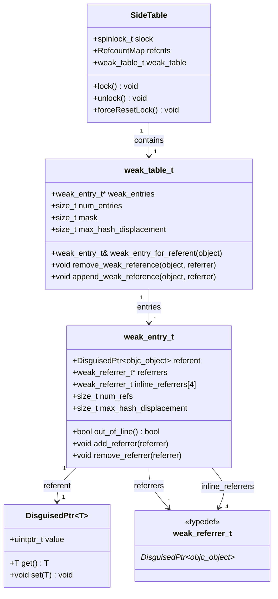
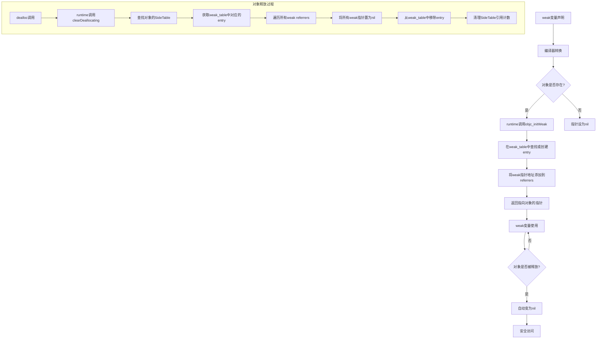
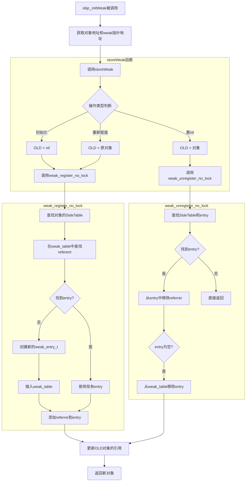
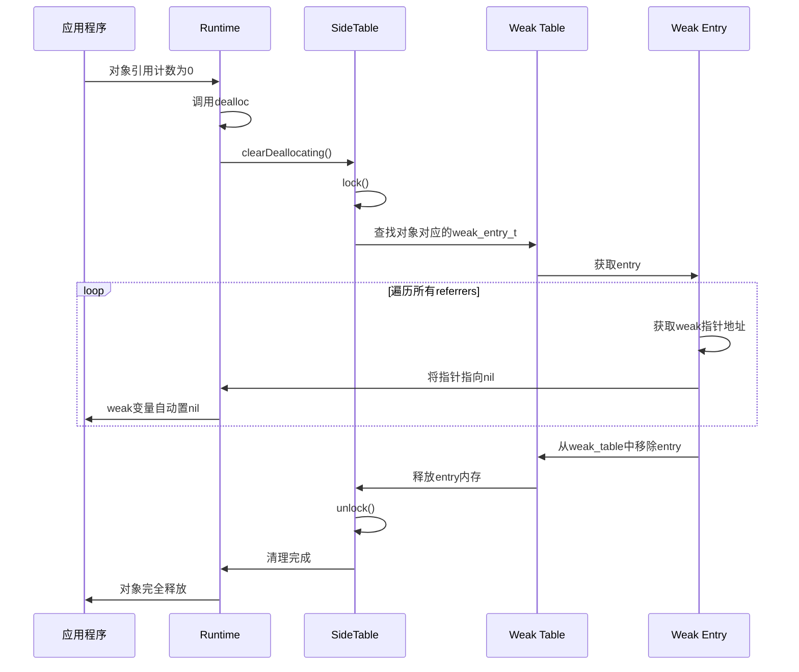
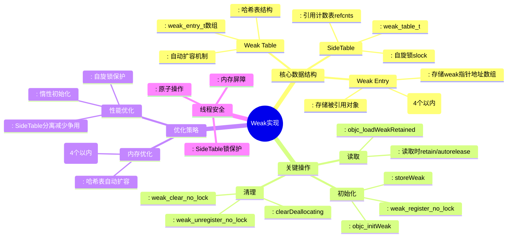
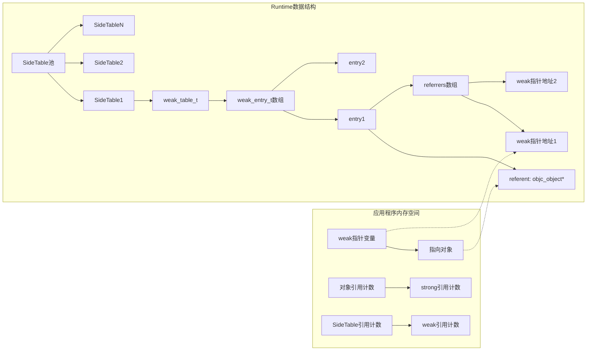

## 1. Weak 引用核心数据结构



## 2. Weak 引用完整生命周期流程



## 3. Weak 表查找和添加详细流程



## 4. 对象释放时 weak 清理流程



## 5. Weak 实现的关键函数和机制



## 6. Weak 引用的内存管理细节



## 7. Weak 引用操作的完整代码路径

```mermaid
flowchart TD
    A[__weak id obj = object] --> B[编译器生成objc_initWeak调用]
    
    subgraph "objc_initWeak"
        B --> C[storeWeak(&obj, object)]
    end
    
    subgraph "storeWeak核心逻辑"
        C --> D[获取对象新旧值]
        D --> E[获取SideTable锁]
        E --> F{新旧对象处理}
        
        F -->|新对象| G[weak_register_no_lock]
        F -->|旧对象| H[weak_unregister_no_lock]
        
        G --> I[在weak_table中添加引用]
        H --> J[从weak_table中移除引用]
        
        I --> K
        J --> K[更新弱引用计数]
    end
    
    K --> L[释放锁]
    L --> M[返回对象]
    
    subgraph "对象释放时"
        N[对象dealloc] --> O[runtime调用_objc_rootDealloc]
        O --> P[调用clearDeallocating]
        P --> Q[weak_clear_no_lock]
        Q --> R[遍历所有weak指针置nil]
        R --> S[清理weak_table]
    end
    
    subgraph "读取weak变量"
        T[id obj2 = obj] --> U[objc_loadWeakRetained]
        U --> V[增加引用计数]
        V --> W[autorelease对象]
        W --> X[返回对象]
    end
    
    M --> Y[weak变量可用]
    S --> Z[weak变量自动为nil]
    X --> AA[安全使用对象]
```

## 关键源码函数说明

根据 objc4 源码，weak 实现主要涉及以下关键函数：

1. **初始化 weak 引用**
   ```cpp
   id objc_initWeak(id *location, id newObj)
   void storeWeak(id *location, objc_object *newObj)
   ```

2. **weak 表操作**
   ```cpp
   void weak_register_no_lock(weak_table_t *weak_table, id referent_id, id *referrer_id)
   void weak_unregister_no_lock(weak_table_t *weak_table, id referent_id, id *referrer_id)
   ```

3. **对象释放清理**
   ```cpp
   void weak_clear_no_lock(weak_table_t *weak_table, id referent_id)
   void clearDeallocating()
   ```

4. **weak 变量读取**
   ```cpp
   id objc_loadWeakRetained(id *location)
   ```

## 总结

Objective-C 的 weak 引用实现是一个复杂的系统，主要特点包括：

1. **两级哈希表结构**：SideTable → weak_table_t → weak_entry_t
2. **线程安全**：通过自旋锁保护 SideTable
3. **内存优化**：使用内联数组存储少量 weak 指针
4. **自动清理**：对象释放时自动置 nil 所有 weak 引用
5. **延迟初始化**：SideTable 和 weak_table 按需创建

这种设计在保证线程安全的同时，提供了高效的 weak 引用管理，是 Objective-C 内存管理的重要组成部分。