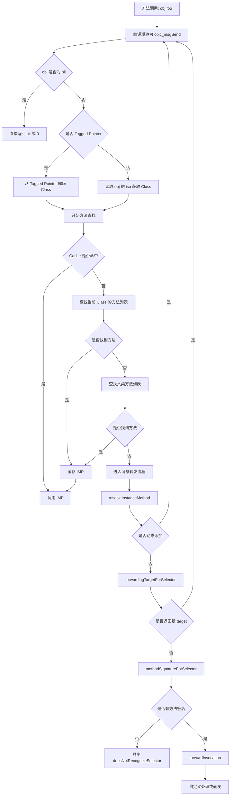

```mermaid
flowchart TD
    A[方法调用: obj foo] --> B[编译期转为 objc_msgSend]

    B --> C{obj 是否为 nil}
    C -- 是 --> Z[直接返回 nil 或 0]
    C -- 否 --> D{是否 Tagged Pointer}

    D -- 是 --> E[从 Tagged Pointer 解码 Class]
    D -- 否 --> F[读取 obj 的 isa 获取 Class]

    E --> G[开始方法查找]
    F --> G

    G --> H{Cache 是否命中}
    H -- 是 --> I[调用 IMP]
    H -- 否 --> J[查找当前 Class 的方法列表]

    J --> K{是否找到方法}
    K -- 是 --> L[缓存 IMP]
    L --> I

    K -- 否 --> M[查找父类方法列表]
    M --> N{是否找到方法}
    N -- 是 --> L

    N -- 否 --> O[进入消息转发流程]

    O --> P[resolveInstanceMethod]
    P --> Q{是否动态添加}
    Q -- 是 --> B
    Q -- 否 --> R[forwardingTargetForSelector]

    R --> S{是否返回新 target}
    S -- 是 --> B
    S -- 否 --> T[methodSignatureForSelector]

    T --> U{是否有方法签名}
    U -- 否 --> V[抛出 doesNotRecognizeSelector]
    U -- 是 --> W[forwardInvocation]
    W --> X[自定义处理或转发]
```